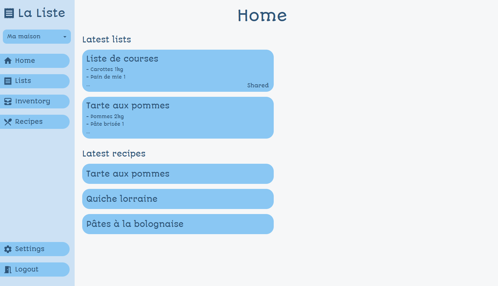

<h1>
  
  La liste - Front-end
</h1>

## Presentation
La liste is an application to keep track of what you have at home and what you need to buy to cook recipes, here is its front-end made in React TypeScript using MaterialUI as stylesheet framework and Material Icons as icons set

## Preview

## Features
- Have multiples homes
- View lists, inventory and recipes
- Add, edit and validate lists
- Edit the inventory
- Add, edit and cook recipes
- Change languages and themes
- Add homes and users
- Set permissions for users
- Assign users to homes

## Installation
First, clone the repository

`git clone https://github.com/La-liste/frontend`

Then go into its folder

`cd frontend`

After that, install the packages and depedencies

`npm install`

And finally, run the application

`npx vite --force`

(use the `--host` argument to be able to access it from other devices)
